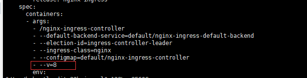
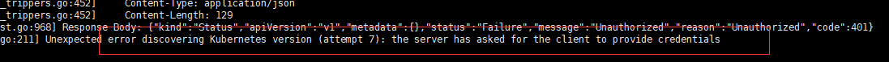
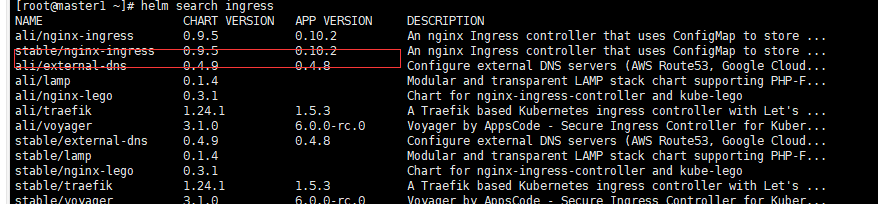
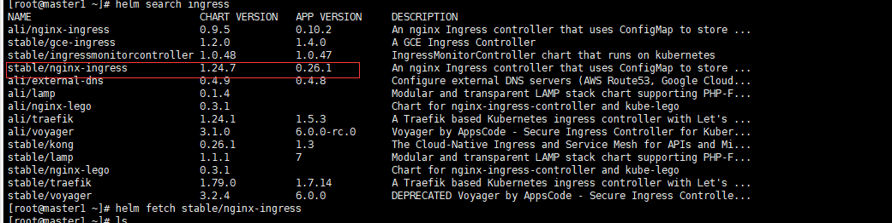

# 使用Helm安装k8s应用

## 调试命令

* 查看pod的启动参数

    这里以kube-apiserver为例

    ```bash
    docker inspect $(docker ps -a | awk '/apiserver/{print $1}') -f "{{.Config.Entrypoint}}"
    ```

## 异常排查

记录在部署、使用nginx-ingress的过程中遇到的异常情况以及解决方法

* ```1. the server has asked for the client to provide credentials```

    查看tiller pod的日志发现以下错误：

    ```bash
    the server has asked for the client to provide credentials

    failed to list: Unauthorized
    ```

    这是缺失认证的文件或账户导致的，所以执行以下语句

    ```bash
    helm init --service-account tiller --upgrade
    ```

* ```2. Error while initializing connection to Kubernetes apiserver. This most likely means that the cluster is misconfigured```

    用helm安装nginx-ingress时，controller起不来，查看log

    1. ```Neither --kubeconfig nor --master was specified.  Using the inClusterConfig.  This might not work.```

        修改deploy的参数，增加- --v=8显示更多的信息

        ```bash
        kubectl -n default edit deployments.apps nginx-ingress-controller
        ```

        

        查看log发现是证书的问题: 具体查看下面的排查过程

    2. ```Unexpected error discovering Kubernetes version (attempt 7): the server has asked for the client to provide credentials```

        

        接着往下排查，发现用helm安装的chart版本是0.9.5，根据nginx官方文档和[yaml](https://github.com/kubernetes/ingress-nginx/tree/master/deploy/static)发现与kubernetes的版本不兼容，所以模板的匹配出错。

        

        换了新的repo后，替换为1.24.7后，终于能正常运行了。

        ```bash
        helm repo add stable http://mirror.azure.cn/kubernetes/charts/
        helm search ingress
        ```

        
