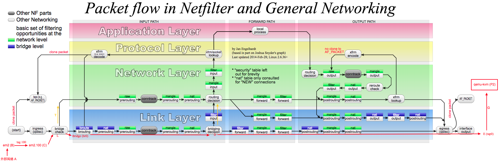

# 云计算底层技术netfilter

目前在云计算，云架构等中广泛应用了linux内核的模块```netfilter```。netfilter是linux内核的数据处理包，其主要功能是：数据包的过滤、修改(包括nat的转换)。整个架构围绕着```三表五链和5个钩子函数模块```。我们后文结合一张经典的图片来展开阐述。


<center>图 1</center>

* ```三表五链```

    表：filter、nat、mangle

    链：PREROUTING、INPUT、FORWORD、OUTPUT、POSTROUTING

* ```五表五链```

    其实，由于常见性只是习惯上称作三表五链，此外还有raw、security。

## conntrack

这是整个iptables的基础，但是是一个独立的内核模块。相关调试技术：conntrack、iptstate这些工具可以查看连接跟踪表的条目。

* 用法

    ```bash
    iptstate

    # 相关内核参数
    sysctl -a | grep conntrack

    # 查看手册
    man conntrack
    conntrack -L
    ```

Linux内核加载nf_conntrack后，conntrack机制正式生效。跟route一样，conntrack也会维护一张表，所有的conntrack都存放在一张表里，这张表称为```连接跟踪表```。

那么，什么时候触发其跟踪数据包呢？结合(图1)，我们得知，在PREROUTING和OUTPUT之前钩子之前能够跟踪数据包，并且为属于新建立连接的数据包生成一个新的conntrack条目，依据属于已有连接的数据包来更新conntrack条目的状态。所以，接下里的重点是如何判断一个数据包是否属于已有的连接。

* ```连接跟踪表```

## 参考文档

* [云计算底层技术-netfilter框架研究](https://opengers.github.io/openstack/openstack-base-netfilter-framework-overview/)

* [wiki netfiler](https://en.wikipedia.org/wiki/Netfilter)
