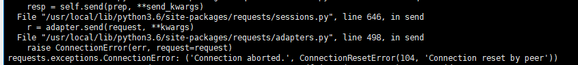

# Python 服务端开发遇到的一些问题

这里主要以requests和tornado为框架

## 大文件占用内存

## 网络连接问题

主要是connection问题。

* 频繁请求

    

    ```python
    # 复用同一个客户端
    http_client = AsyncHTTPClient()

    async def fetch(request: HTTPRequest) -> HTTPResponse:
        # for i in range(3):
        try:
            response = await http_client.fetch(request)
        except Exception:
            # Other errors are possible, such as IOError.
            # if i < 2:
            asyncio.sleep(0.5)
            raise
        else:
            asyncio.sleep(0.1)
        return response
    ```

    在上面这段代码里，有两个需要注意的点：</br>
    异步和异常处理。这里只是简单的在```异步等待```一段时间后将错误抛出。```asyncio.sleep```可以缓解请求过于频繁的问题，在并发和爬虫场景经常会碰到。

* 网关超时

    一般在一个集群中的服务器会配置一个统一的网关超时时间。这种情可以按照以下步骤排查：</br>
    (1) 确认网关没有发生故障</br>
    (2) 查看服务access日志，是否遇到耗时的请求，cpu/io。</br>

    可能的解决方法:</br>
    (1) 重启nginx网关等</br>
    (2) 遇到耗时的请求时，根据需要细分每个请求发送到消息队列</br>

## 并发

在python中并发的实现可以使用```线程、异步、协程```。

* 在协程中用线程池并发可能会阻塞进程

    ```py
    @gen.coroutine
    def post(self):
        MAX_WORKERS = 4
        with ThreadPoolExecutor(max_workers=MAX_WORKERS) as executor:
            ....
    ```

    ```如果后端有查询实在是太慢，无法绕过，Tornaod的建议是将这些查询在后端封装独立封装成为HTTP接口，然后使用Tornado内置的异步HTTP客户端进行调用。```
    这是一段血泪代码，在生产环境中这样用的时候，会导致在线程池中的任务执行完前，整个进程阻塞等待。可以这样修改:

    ```py
    async def post(self):
        # to_do 是一个类似协程的列表
        res = await gen.multi(to_do)
    ```

* 最大连接和异步客户端

    应该根据请求来配置客户端队列的大小，以避免同时大量并发造成大量的超时。

    ```py
    # 需要提前配置，第一个参数为None表示使用默认的SimpleClient
    AsyncHTTPClient.configure(None, max_clients=15)  # 默认为10
    # 这是一段post的代码，配置了request_timeout字段
    async def fetch_image(
    url: str,
    post_dict: dict) -> HTTPResponse:
    header_dict = {
        'Content-Type': 'application/json'
    }
    request_kwargs = {
        'headers': header_dict
    }
    request = HTTPRequest(
        url=url, method='POST', request_timeout=30.0,
        **request_kwargs, body=json.dumps(post_dict))
    try:
        resp = await fetch(request)
    except Exception as e:
        raise e
    return resp
    ```

    为了限制并发数还可以使用[信号量等](https://www.tornadoweb.org/en/stable/coroutine.html)

* 并发协程

    Tornado可以同时执行多个异步，并发的异步可以使用列表或字典。</br>
    在python的协程用法是大同小异的。虽然下面代码的版本稍旧，但是原理是一致的。

    ```py
    class Handler(tornado.web.RequestHandler):
        @tornado.gen.coroutine
        def get(self):
            iterator = [self.fetch(url) for url in urls]
            yield iterator

    @tornado.gen.coroutine
    def fetch(self, url):
        http = tornado.httpclient.AsyncHTTPClient()
        response = yield http.fetch(url)
        raise tornado.gen.Return(rep)
    ```
